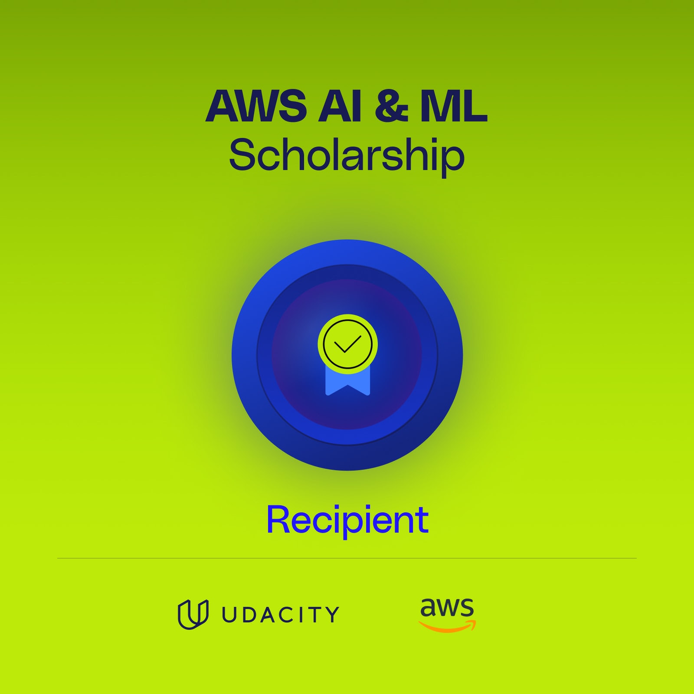

# AI Programming with Python Nanodegree Journey



This repository contains my journey through the "AI Programming with Python Nanodegree Program." In this program, I will learn the foundations of AI and machine learning, gained proficiency in Python, NumPy, Pandas, Matplotlib, PyTorch, and linear algebra, and build the skills necessary to create neural networks.

## Program Overview

The "AI Programming with Python Nanodegree Program" provided a comprehensive introduction to the world of artificial intelligence and machine learning. Throughout the program, will covered a wide range of topics and developed the following skills:

- **Python:** I honed my Python programming skills, becoming proficient in this versatile language, which is a fundamental tool in AI and data science.

- **NumPy and Pandas:** I learned how to efficiently manipulate and analyze data using NumPy and Pandas, essential libraries for data processing.

- **Matplotlib:** I mastered data visualization with Matplotlib, enabling me to create clear and informative graphs and charts.

- **PyTorch:** The program equipped me with the knowledge and skills to work with PyTorch, a popular deep learning framework.

- **Linear Algebra:** I gained a solid foundation in linear algebra, a crucial mathematical concept for understanding the inner workings of neural networks.

- **Neural Networks:** I learned how to design, train, and evaluate neural networks, and I built a strong understanding of the architecture and principles behind this technology.

## Repository Contents

```python
>>> print("🚀stay tuned🚀")
```

## Nanodegree Completion

```python
>>> print("🚀stay tuned🚀")
```
